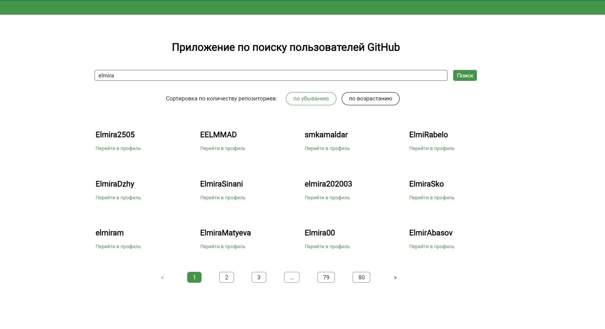

Аттестационный проект в школе SkyPro - сайт по поиску пользователей Githab

Функциональность проекта:

- поиск пользователей Githab по логину;
- сортировка: по количеству репозиториев (возрастанию/убыванию);
- пагинация ;
- при клике на пользователя можно посмотреть дополнительную информацию о нем.

Технологии, используемые в проекте:

React
Styled Components
Redux
React Router

Библиотека: axios.

Инструкция по локальному запуску приложения:

1.Клонируйте репозиторий на свой компьютер: git clone <URL репозитория>
2.Установите зависимости: npm install
3.Запустите приложение: npm start
4.Откройте http://localhost:3000 в браузере, чтобы увидеть ваше приложение.
5.Деплой проекта: https://steady-boba-2ad9bf.netlify.app

Скриншот главной страницы:
